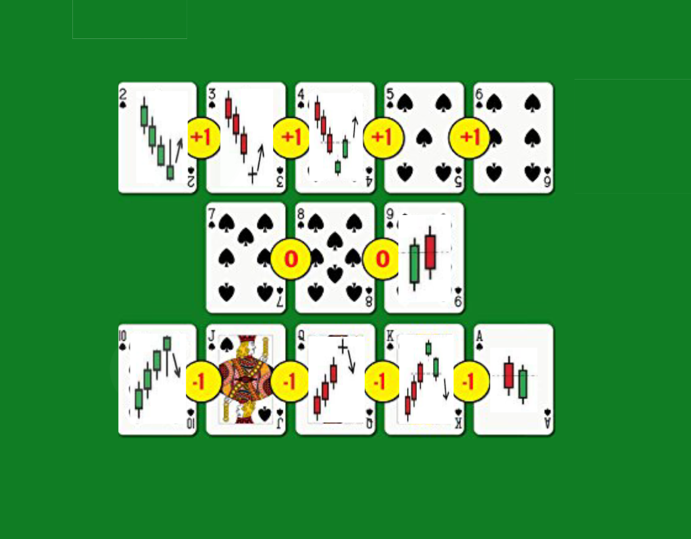

# Project No. 1: Counting Cards but for Equities

#

## Background

**Automated trading** (Auto-Trader) is a method of trading that utilizes algorithms to execute entries and exits automatically. This process can be viewed as beneficial as a successful algorithm will execute trades under very strict and well defined rules all while eliminating the emotional factor that can be involved with taking losses and/or profits on a trade.

Algorithms used for Auto-Trading can be incredibly complex, requiring huge computational power to analyze all of the variables and statistical correlations that are taking place throughout the live analysis of data pouring into the system. Further, directed predictive algorithms utilizing company fundamentals, global political states, and global economic finance set a tone for only the mathematical geniuses of the world to understand.

In the case of our project, we have decided to simplify calculations and our algorithm. We have established a methodology of reading price action revolving around the Efficient Market Hypothesis (EMH), in that the stock market price in the moment reflects all of the news, data, company information, economic status that would impact the stock price at the given moment. The EMH states that stocks always trade at their fair value on exchanges, making it impossible for investors to purchase undervalued stocks or sell stocks for inflated prices.[^1]

Price Action Trading - "In simple terms, price action trading is a technique that allows a trader to read the market and make subjective trading decisions based on recent and actual price movements..."[^2] We are also incorporating, for now, rudimentary technical analysis[^3][^4].

In review of methods to utilize the EMH we took the concept of counting cards in black jack and apply that to price action trading methods. This process, in its' essence, simplifies complex predictive probabilities into simple integers - one (1), zero (0), and negative 1 (-1), etc.

## Process

### Hypothesis

The concept of counting cards can be applied to that of price action trading.

### Code Methodology

1. Import all appropriate libraries.

2. Access required data from API.

3. Perform necessary data clean up.

4. Visualize imported data.

5. Initialize appropriate variables and needed dataframe columns.

6. Establish logic to process data.

7. Visualize data results and compare to standard but and hold trading methods.

## Files

* 

## Visuals

* 

## Conclusion/Next Steps

Review of the results returned identify that our simplification process of price action can be used to potentially profitably trade equities.

Next steps would be in incorporate additional logic statements identifying further bullish/bearish candlestick patterns.

We would additionally want to analyze various equities over, various buy/sell thresholds, and test whether our hypothesis is statistically significant in producing favorable results.

### Overall Project Guideline Checklist

* Technical Requirements
   1. Use Pandas to clean and format dataset.
   2. Create Jupyter Notebook describing all processes within.
   3. Create Jupyter Notebook illustrating final data analysis.
   4. Use HvPlot to create 6 - 8 data visualizations.
   5. Save PNG images of visualization to distribute to the class and instructional team.
   6. Use a Python library that has not been covered in class (Plotly).
   7. Use API (Alpaca).
   8. Create a README.md file within the repo summarizing project and major findings.

Footnotes:

[1] The Library of Economics and Liberty. "Efficient Capital Markets."
[2] Investopedia. "https://www.investopedia.com/articles/active-trading/110714/introduction-price-action-trading-strategies.asp"
[3] Reading Price Chart Bay by Bay. Al Brooks
[4] Charting and Technical Analysis. Fred McAllen